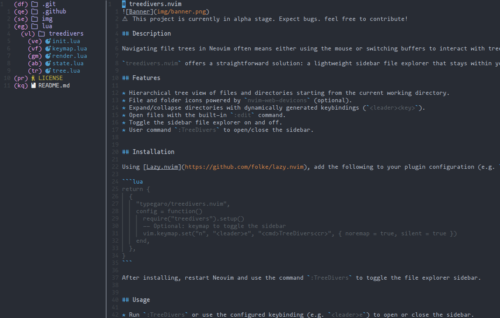

# treedivers.nvim

⚠️ This project is currently in alpha stage. Expect bugs. feel free to contribute!

## Description

Navigating file trees in Neovim often means either using the mouse or switching buffers to interact with tree explorers. Both approaches can feel slow and interrupt your flow. Switching buffers breaks your focus, and relying on the mouse goes against the keyboard-driven philosophy of Neovim. This friction can make managing files more tedious than it needs to be.

`treedivers.nvim` offers a straightforward solution: a lightweight sidebar file explorer that stays within your current Neovim session and uses intuitive keybindings to open files or toggle directories without ever leaving your main editing context. No mouse clicks, no buffer switching. Just simple, fast navigation that fits naturally into the Neovim way of working.

## Features

* Hierarchical tree view of files and directories starting from the current working directory.
* File and folder icons powered by `nvim-web-devicons` (optional).
* Expand/collapse directories with dynamically generated keybindings (`<leader><key>`).
* Open files with the built-in `:edit` command.
* Toggle the sidebar file explorer on and off.
* User command `:TreeDivers` to open/close the sidebar.


## Installation

Using [Lazy.nvim](https://github.com/folke/lazy.nvim), add the following to your plugin configuration (e.g. `lua/plugins.lua`):

```lua
return {
  {
    "typegaro/treedivers.nvim",
    config = function()
      require("treedivers").setup()
      -- Optional: keymap to toggle the sidebar
      vim.keymap.set("n", "<leader>e", ":TreeDivers<CR>", { noremap = true, silent = true })
    end,
  },
}
```

After installing, restart Neovim and use the command `:TreeDivers` to toggle the file explorer sidebar.


## Usage

* Run `:TreeDivers` or use the configured keybinding (e.g. `<leader>e`) to open or close the sidebar.
* Browse files and directories shown in the tree.
* Use the shortcut keys shown next to each file/directory to open files or expand/collapse folders.
* The tree view automatically refreshes as you open or close directories.


## Dependencies

* [nvim-web-devicons](https://github.com/nvim-tree/nvim-web-devicons) (optional, for file and folder icons)


## Development Notes

* Keybindings for opening files and toggling folders are generated dynamically and mapped globally.
* The internal tree structure is recursive, lazily loading children of expanded directories.
* The sidebar window is a dedicated vertical split with configurable width (default 30 columns).


## Contributing

**All contributions are welcome!**
This plugin is in its early stages, and there’s plenty of room for improvement. Whether you’ve found a bug, have a feature request, or want to submit a pull request, you're invited to contribute.

### How to contribute

1. **Open an issue first**, if necessary.
   If you're planning a new feature or major fix, please open an issue on GitHub to describe the problem or propose your idea. This allows for discussion and avoids duplicated work.

2. **Fork the repository** on GitHub.

3. **Clone your fork locally** and create a new branch based on the issue you're addressing:
   Use a naming convention that references the issue number. For example, if you're working on issue `#42`:

   ```bash
   git checkout -b fix/sidebar-width-#42
   ```

4. **Make your changes** and commit them with clear, concise messages. Reference the issue in your commit message if applicable:

   ```
   fix: adjust sidebar width logic (#42)
   ```

5. **Push to your fork**:

   ```bash
   git push origin fix/sidebar-width-#42
   ```

6. **Open a pull request** on GitHub, describing what you've changed and linking to the relevant issue.

---

Before submitting, please:

* Test your changes.
* Keep the code clean and documented.
* Stick to Lua best practices.
* Keep commits focused and readable.

If in doubt, feel free to **open an issue first** to ask questions or get feedback before starting work.
